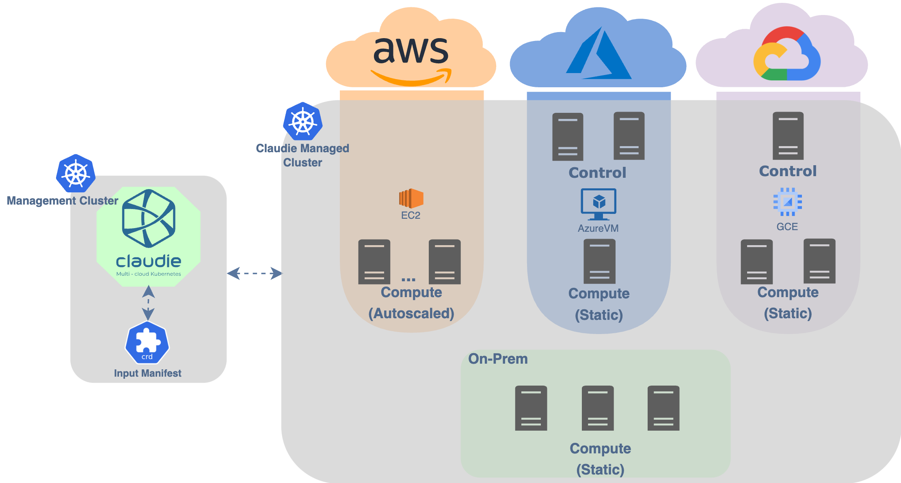

# Claudie


[](https://opensource.org/licenses/Apache-2.0)
[](https://goreportcard.com/report/github.com/berops/claudie)

Platform for managing multi-cloud Kubernetes clusters with each nodepool in a different cloud-provider.

## Features

### Manage multi-cloud Kubernetes clusters

Create fully-featured Kubernetes clusters composed of multiple different public Cloud providers in an easy and secure manner.
Simply insert credentials to your cloud projects, define your cluster, and watch how the infra spawns right in front of you.



### Management via IaC

Declaratively define your infrastructure with a simple, easy to understand YAML [syntax](./docs/input-manifest/input-manifest.md).
See example [manifest](./docs/input-manifest/example.yaml).

### Fast scale-up/scale-down of your infrastructure

To scale-up or scale-down, simply change a few lines in the input manifest and Claudie will take care of the rest in the matter of minutes.

### Loadbalancing

Claudie has its own managed load-balancing solution, which you can use for Ingresses, the Kubernetes API server, or generally anything. Check out our [LB docs](https://github.com/berops/claudie/tree/master/docs/loadbalancing).

### Persistent storage volumes

Claudie comes pre-configured with a storage solution, with ready-to-use Storage Classes. See [Storage docs](https://github.com/berops/claudie/tree/master/docs/storage) to learn more.

## Get started using Claudie

1. Deploy Claudie Kubernetes [manifests/claudie](https://github.com/berops/claudie/tree/master/manifests/claudie) into a Kubernetes cluster:

   ```sh
   kubectl apply -k manifests/claudie
   ```

2. provide your own manifest via a Kubernetes Secret.

Have a look at our [reference example input manifest](https://github.com/berops/claudie/blob/master/docs/input-manifest/example.yaml) to explore what's possible.

To see in detail how to correctly apply the manifest into Claudie, please refer to the [CRUD](./docs/crud/crud.md) document.

After the input manifest is successfully applied, the kubeconfig to your newly
built clusters is output as a secret in the `claudie` namespace with a name in
the form of `<cluster-name>-<cluster-hash>-kubeconfig`.

## Get involved

<!-- Contributor guidelines -->
Everyone is more than welcome to open an issue, a PR or to start a discussion.

For more information about contributing please read the [contribution guidelines](./docs/contributing/contributing.md).

If you want to have a chat with us, feel free to join our ["claudie-workspace" Slack workspace](https://join.slack.com/t/claudie-workspace/shared_invite/zt-1imfso8r4-xwrpZjL9kt61FT1LjvWD5w).

## Security

While we strive to create secure software, there is always a chance that we
miss something.
If you've discovered something that requires our attention, see [our security
policy](SECURITY.md) to learn how to proceed.

## Roadmap
<!-- Add a roadmap for claudie so users know which features are being worked on and which will in future -->
To see the vision behind Claudie, please refer to the [roadmap](./docs/roadmap/roadmap.md) document.

## LICENSE

Apache-2.0 (see [LICENSE](LICENSE) for details).
