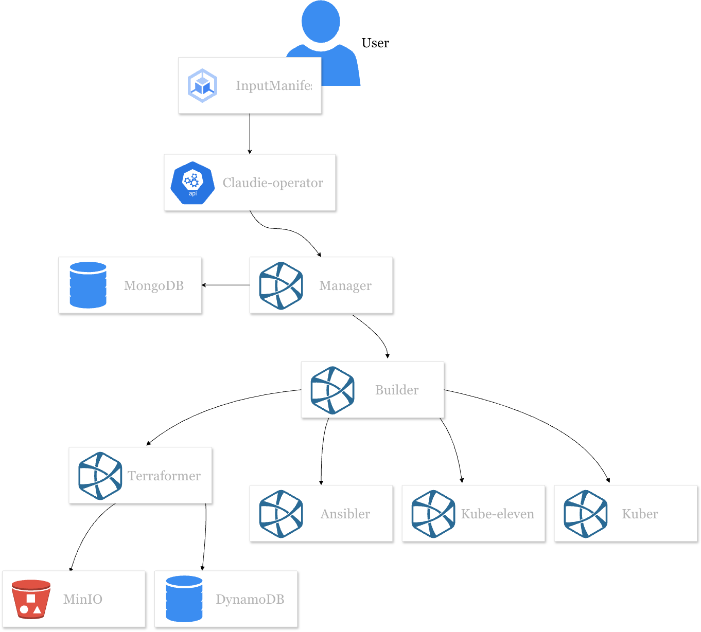

# Claudie

## A single platform for multiple clouds

### Microservices

- [Manager](https://github.com/berops/claudie/tree/master/services/manager)
- [Builder](https://github.com/berops/claudie/tree/master/services/builder)
- [Terraformer](https://github.com/berops/claudie/tree/master/services/terraformer)
- [Ansibler](https://github.com/berops/claudie/tree/master/services/ansibler)
- [Kube-eleven](https://github.com/berops/claudie/tree/master/services/kube-eleven)
- [Kuber](https://github.com/berops/claudie/tree/master/services/kuber)
- [Claudie-operator](https://github.com/berops/claudie/tree/master/services/claudie-operator)

### Data stores

- [MongoDB](https://github.com/berops/claudie/tree/master/manifests/claudie/mongo)
- [Minio](https://github.com/berops/claudie/tree/master/manifests/claudie/minio)
- [DynamoDB](https://github.com/berops/claudie/tree/master/manifests/claudie/dynamo)

### Tools used

- [Terraform](https://github.com/hashicorp/terraform)
- [Ansible](https://github.com/ansible/ansible)
- [KubeOne](https://github.com/kubermatic/kubeone)
- [Longhorn](https://github.com/longhorn/longhorn)
- [Nginx](https://www.nginx.com/)
- [Calico](https://github.com/projectcalico/calico)
- [gRPC](https://grpc.io/)

## Manager

Manger is the brain and main entry point for claudie.
To build clusters users/services submit their configs to the manager service. The manager creates the desired state and schedules a number of jobs to be executed in order to achieve the desired state based on the current state. The jobs are then picked up by the builder service.

For the API see the [GRPC definitions](../../proto/manager.proto).

### Flow

Each newly created manifest starts in the Pending state. Pending manifests
are periodically checked and based on the specification provided in the applied configs, the desired
state for each cluster, along with the tasks to be performed to achieve the desired state are created,
after which the manifest is moved to the  scheduled state. Tasks from Scheduled manifests are picked up
by builder services gradually building the desired state. From this state, the manifest can end up in the 
Done or Error state. Any changes to the input manifest while it is in the Scheduled state will be reflected after 
it is moved to the Done state. After which the cycle repeats.

Each cluster has a current state and desired state based on which tasks are created. The desired state is created only
once, when changes to the configuration are detected. Several tasks can be created that will gradually converge the current
state to the desired state. Each time a task is picked up by the builder service the relevant state from the current state
is transferred to the task so that each task has up-to-date information about current infrastructure and its up to the
builder service to build/modify/delete the missing pieces in the picked up task.

Once a task is done building, either in error of successfully, the current state should be updated by the builder
service so that the manager has the actual information about the current state of the infrastructure. When the
manager receives a request for the update of the current state it transfers relevant information to the desired state
that was created at the beginning, before the tasks were scheduled. This is the only point where the desired state is
updated, and we only transfer information from current state (such as newly build nodes, ips, etc...). After all tasks
have finished successfully the current and desired state should match.

## Builder

Processed tasks scheduled by the manager gradually building the desired state of the infrastructure. It communicates with `terraformer`, `ansibler`, `kube-eleven` and `kuber` services in order to manage the infrastructure. 

### Flow

- Periodically polls Manager for available tasks to be worked on.
- Communicates with Terraformer, Ansibler, Kube-eleven and Kuber
- After a task is completed, either successfully or not, the current state is updated along with the status, if errored.

## Terraformer

Terraformer creates or destroys infrastructure via Terraform calls.

For the API see the [GRPC definitions](../../proto/terraformer.proto).

## Ansibler

Ansibler uses Ansible to:

- set up Wireguard VPN between the infrastructure spawned in the Terraformer service. 
- set up nginx load balancer for the infrastructure
- install dependencies for required by nodes in a kubernetes cluster

For the API see the [GRPC definitions](../../proto/ansibler.proto).

## Kube-eleven

Kube-eleven uses [KubeOne](https://github.com/kubermatic/kubeone) to spin up a kubernetes clusters,
out of the spawned and pre-configured infrastructure.

For the API see the [GRPC definitions](../../proto/kubeEleven.proto).

## Kuber

Kuber manipulates the cluster resources using `kubectl`.

For the API see the [GRPC definitions](../../proto/kuber.proto).

## Claudie-operator

Claudie-operator is a layer between the user and Claudie. It is a `InputManifest` Custom Resource Definition controller, 
that will communicate with the `manager` service to communicate changes to the config made by the user.

### Flow

- User applies a new InputManifest crd holding a configuration of the desired clusters
- Claudie-operator detects it and processes the created/modified input manifest
- Upon deletion of user-created InputManifest, Claudie-operator initiates a deletion process of the manifest
