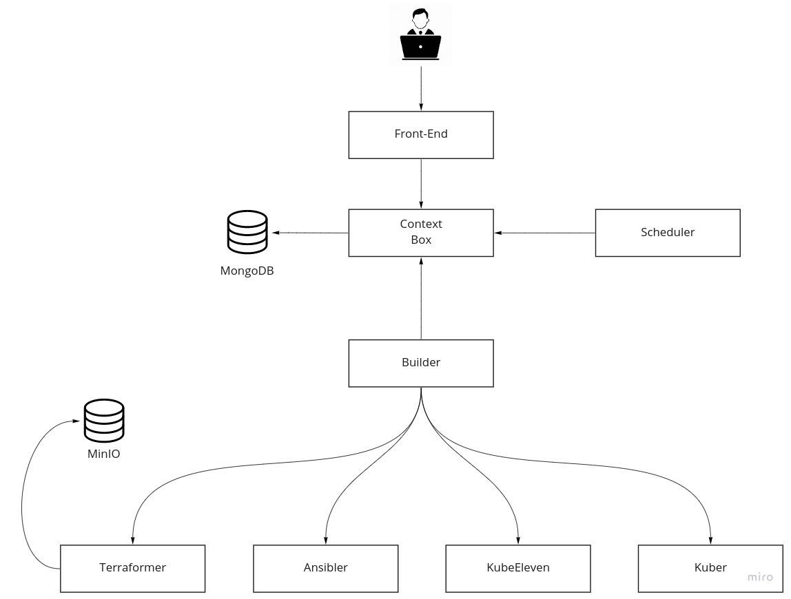

# Claudie
### Single platform for multiple clouds



### Microservices
- [Context-box](https://github.com/Berops/platform/tree/master/services/context-box)
- [Scheduler](https://github.com/Berops/platform/tree/master/services/scheduler)
- [Builder](https://github.com/Berops/platform/tree/master/services/builder)
- [Terraformer](https://github.com/Berops/platform/tree/master/services/terraformer)
- [Ansibler](https://github.com/Berops/platform/tree/master/services/ansibler)
- [Kube-eleven](https://github.com/Berops/platform/tree/master/services/kube-eleven)
- [Kuber](https://github.com/Berops/platform/tree/master/services/kuber)
- [Frontend](https://github.com/Berops/platform/tree/master/services/frontend)

### Data stores
- [MongoDB](https://github.com/Berops/platform/blob/master/K8s-dev-cluster/mongodb.yaml)
- [Minio](https://github.com/Berops/platform/tree/master/K8s-dev-cluster/minio)

### Tools used
- [Terraform](https://github.com/hashicorp/terraform)
- [Ansible](https://github.com/ansible/ansible)
- [KubeOne](https://github.com/kubermatic/kubeone)
- [Longhorn](https://github.com/longhorn/longhorn)
- [Nginx](https://www.nginx.com/)
- [Calico](https://github.com/projectcalico/calico)
- [K8s-sidecar](https://github.com/kiwigrid/k8s-sidecar)
- [gRPC](https://grpc.io/)


## Context-box
Context box is "control unit" for the Claudie. It holds pending configs, which needs to be processed, periodically checks for the new/changed configs and receives new configs from `frontend`.

### API

```go
  //Save config parsed by Frontend
  rpc SaveConfigFrontEnd(SaveConfigRequest) returns (SaveConfigResponse);
  //Save config parsed by Scheduler
  rpc SaveConfigScheduler(SaveConfigRequest) returns (SaveConfigResponse);
  //Save config parsed by Builder
  rpc SaveConfigBuilder(SaveConfigRequest) returns (SaveConfigResponse);
  //Get single config from database
  rpc GetConfigFromDB(GetConfigFromDBRequest) returns (GetConfigFromDBResponse);
  // *(NEEDS DELETION)*
  rpc GetConfigByName(GetConfigByNameRequest) returns (GetConfigByNameResponse);
  //Get config from scheduler queue of pending configs
  rpc GetConfigScheduler(GetConfigRequest) returns (GetConfigResponse);
  //Get config from builder queue of pending configs
  rpc GetConfigBuilder(GetConfigRequest) returns (GetConfigResponse);
  //Get all configs from database
  rpc GetAllConfigs(GetAllConfigsRequest) returns (GetAllConfigsResponse);
  //Delete a single config from database
  rpc DeleteConfig(DeleteConfigRequest) returns (DeleteConfigResponse);
```
### Flow

- Receives config file from Frontend calculates `msChecksum` and saves it to the database
- Periodically push config where `msChecksum` != `dsChecksum` to the schedulerQueue
- Periodically push config where `dsChecksum` != `csChecksum` to the builderQueue
- Receives config with desiredState from Scheduler
- Checks if `dsChecksum` == `msChecksum`
    - `true` -> saves it to the database
    - `false` -> it ignores this config
- Receives config with currentState from Builder and saves it to the database
- Checks if `csChecksum` == `dsChecksum`
    - `true` -> saves it to the database
    - `false` -> it ignores this config

##### `msChecksum` - manifest checksum
##### `dsChecksum` - desired state checksum
##### `csChecksum` - current state checksum


## Scheduler
Scheduler creates desired state of the infra based on the manifest taken from the config received from Context-box.

Scheduler also monitors health of the current infra and manages any operations based on it, e.g. replacement of broken node, etc. *[work in progress]*

### API
```
This service is gRPC client, thus it does not provide any API
```

### Flow
- Periodically pulls `config` from Context-Box's `schedulerQueue`
- Creates desiredState with `dsChecksum` from config
- Sends `config` file back to Context-box


## Builder
Builder aligns the current state of the infrastructure with the desired state. It calls methods on `terraformer`, `ansibler`, `kube-eleven` and `kuber` in order to manage the infrastructure. Builder also takes care of deleting nodes from kubernetes cluster by finding difference between `desiredState` and `currentState`.

### API
```
This service is gRPC client, thus it does not provide any API
```

### Flow
- Periodically pulls `config` from Context-Box's `builderQueue`
- Calls Terraformer, Ansibler, Kube-eleven and Kuber
- Creates `currentState`
- Sends updated config with `currentState` to Context-box


## Terraformer
Terraformer creates or destroys infra specified in the desired state via terraform calls. 

### API
```go
  //Builds the infrastructure based on the provided desired state (includes addition/deletion of stuff)
  rpc BuildInfrastructure(BuildInfrastructureRequest) returns (BuildInfrastructureResponse);
  //Destroys the infrastructure completely
  rpc DestroyInfrastructure(DestroyInfrastructureRequest) returns (DestroyInfrastructureResponse);
```

### Flow
- Receives `config` from Builder
- Uses Terraform to create an infrastructure from `desiredState`
- Updates `currentState` in a `config`
- On infra deletion, destroys the infra based on the current state

## Ansibler
Ansibler uses Ansible to set up:
  - Wireguard VPN between the nodes
  - nginx loadbalancer
  - installs dependencies for nodes in kubernetes cluster

### API

```go
  //InstallNodeRequirements installs any requirements there are on all of the nodes
  rpc InstallNodeRequirements(InstallRequest) returns (InstallResponse);
  //InstallVPN installs VPN between nodes in the k8s cluster and lb clusters
  rpc InstallVPN(InstallRequest) returns (InstallResponse);
  //SetUpLoadbalancers sets up the loadbalancers, DNS and verifies their configuration
  rpc SetUpLoadbalancers(SetUpLBRequest) returns (SetUpLBResponse);
```

### Flow
- Receives `config` from Builder for `InstallVPN()`
  - Sets up the ansible inventory, and installs the Wireguard full mesh VPN via playbook
  - Updates `currentState` in a `config`
- Receives `config` from Builder for `InstallNodeRequirements()`
  - Sets up the ansible inventory, and install any requirements nodes in the infra might need
  - Updates `currentState` in a `config`
- Receives `config` from Builder for `SetUpLoadbalancers()`
  - Sets up the ansible inventory, and installs nginx loadbalancers
  - Creates and verifies the DNS configuration for the loadbalancers


## Kube-eleven
Kube-eleven uses kubeOne to set up kubernetes clusters. If the cluster was build, it assures the cluster is healthy and running as it should.

### API
```go
  //BuildCluster will build the kubernetes clusters as specified in provided config
  rpc BuildCluster(BuildClusterRequest) returns (BuildClusterResponse);
```

### Flow
- Receives `config` from Builder
- Generates kubeOne manifest from `desiredState`
- Uses kubeOne to provision kubernetes cluster
- Updates `currentState` in a `config`

## Kuber
Kuber manipulates the cluster resources using `kubectl`.

### API
```go
  //SetUpStorage installs Longhorn into the cluster
  rpc SetUpStorage(SetUpStorageRequest) returns (SetUpStorageResponse); 
  //StoreKubeconfig will create a secret which holds kubeconfig of the Claudie created cluster
  rpc StoreKubeconfig(StoreKubeconfigRequest) returns (StoreKubeconfigResponse);
  //DeleteKubeconfig will remove a secret that holds kubeconfig of Claudie created cluster
  rpc DeleteKubeconfig(DeleteKubeconfigRequest) returns (DeleteKubeconfigResponse);
```

### Flow
- Receives `config` from Builder for `SetUpStorage()`
- Applies longhorn deployment
- Receives `config` from Builder for `StoreKubeconfig()`
- Create a kubernetes secret which holds kubeconfig of the Claudie created cluster
- On infra deletion, deletes the secret which holds kubeconfig of deleted cluster

## Frontend
Frontend is a layer between user and the Claudie. It periodically check if any new manifests has been saved, and if yes, it pushes them to the database.
The new manifests are added as a secret into the kubernetes cluster where, `k8s-sidecar` will save them into the Frontends file system.

### API
```
This service is gRPC client, thus it does not provide any API
```

### Flow
- User applies new secret holding a manifest
- `k8s-sidecar` will detect it and save it to the Frontend's file system
- Frontend detects new manifest and saves it to the database
- On deletion of user created secret, Frontend initiates deletion process of the manifest